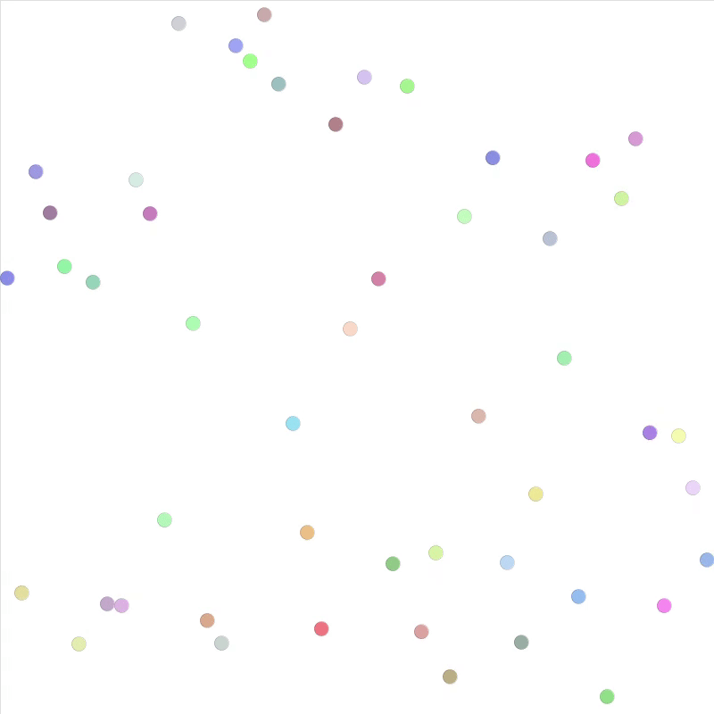

# U14 | Circle Rain, Circle Rain

In dieser Aufgabe geht es darum, mit zwei Arrays die Animation von einer beliebigen Anzahl an Kreisen zu verwalten. Über eine Konstanten soll festgelegt werden, wieviele Kreise gezeichnet werden. Entsprechend sollen weitere Konstanten bestimmen, wie breit ein Kreis ist, so dass alle nebeneinander auf die Zeichenfläche passen.

Alle Kreise haben eine Startposition am oberen Bildschirmrand. Zu Beginn des Programms sollen jeweils ein Array mit den Kreisen und ein Array mit Geschwindigkeiten angelegt werden. Beide Arrays sollen die gleiche Größe haben. Die Geschwindigkeiten und die Farbe der Kreise sind zufällig zu wählen.

In der `draw()`-Schleife sollen nun alle Kreise mit der ihnen entsprechenden Geschwindigkeit vertikal nach unten bewegt werden. Stößt ein Kreis am unteren Rand an, so ist seine Position so anzupassen, dass er wieder am oberen Bildschirmrand startet.

In der folgenden GIF-Animation ist das Ergebnis zu sehen:

| Die fallenden Kreise |
|:------:|
|  |
